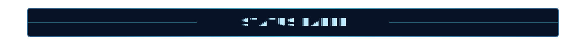
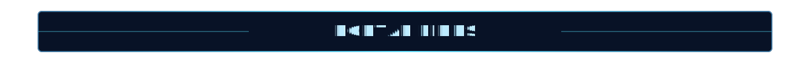

  

  

  

  

I am a Finance major at **National Taipei University** with a unique blend of financial rigor and technical agility.  
I specialize in **refactoring complexity**: whether it is an over-engineered Python pipeline or a multi-asset investment portfolio.

- `CURRENT_ASSIGNMENT`: NTPU ESG Center
- `ACADEMIC_TRACK`: Finance @ NTPU
- `TARGET_QUEST`: 2026 Summer Internship
- `OFF_DUTY_MODE`: Motor / AOV / Badminton
- `CALL_SIGN`:   Warhammer 40K

  

  

**Core Languages**

**Tools and Platforms**

**Finance Domain**

  

  

  
  

  

  

  

  

<table width="100%" align="center" border="0">
  <tr>
    <td align="center" width="33%">
      
    </td>
    <td align="center" width="34%">
      
    </td>
    <td align="center" width="33%">
      
    </td>
  </tr>
</table>

  

  

