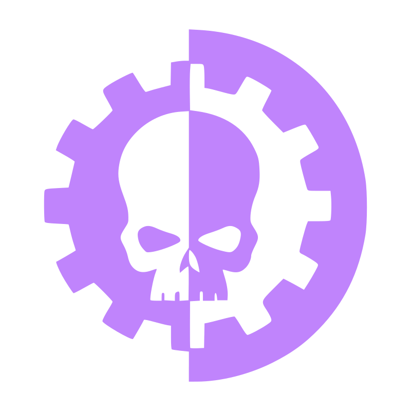
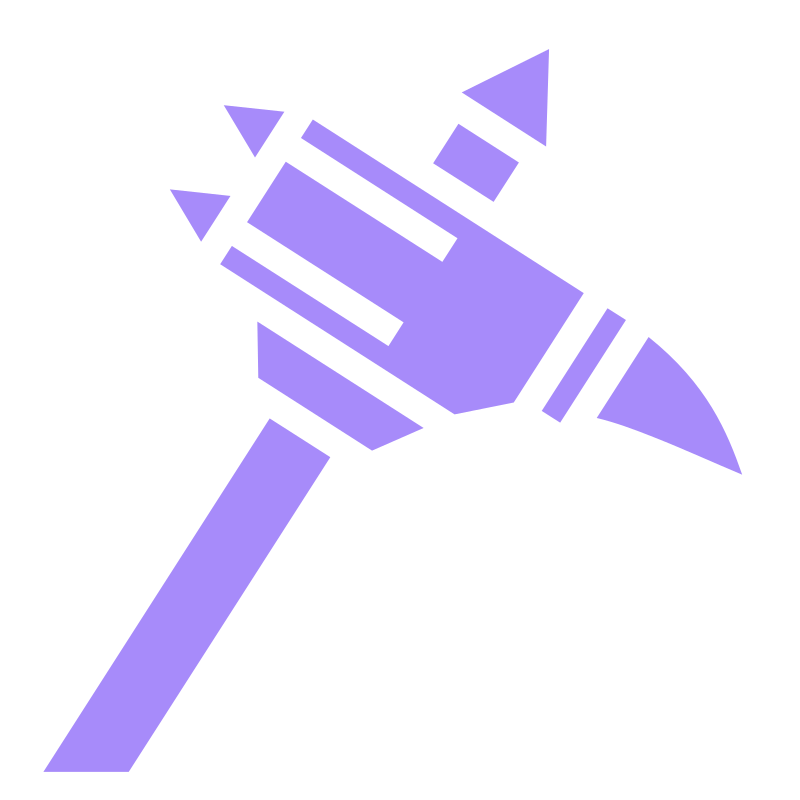

  

---

### 🚀 About Me

I am a Finance major at **National Taipei University** with a unique blend of financial rigor and technical agility.
I specialize in **refactoring complexity** — whether it's an over-engineered Python pipeline or a multi-asset investment portfolio.

- 🔭 Currently working at **NTPU ESG Center**
- 🌱 Studying **Finance** @ NTPU
- 🤔 Looking for **2026 Summer Internship**
- ⚡ Motor · AOV · Badminton
-  Pronouns:  Warhammer 40K

---

### 🛠️ Tech Stack

**Languages**

**Tools & Platforms**

**Finance**

---

### 📊 GitHub Stats

  
  

  

  

---

### 📫 Connect with Me

 

<table width="100%" align="center" border="0">
  <tr>
    <td align="center" width="33%">
      
    </td>
    <td align="center" width="34%">
      
    </td>
    <td align="center" width="33%">
      
    </td>
  </tr>
</table>

  

  

 

